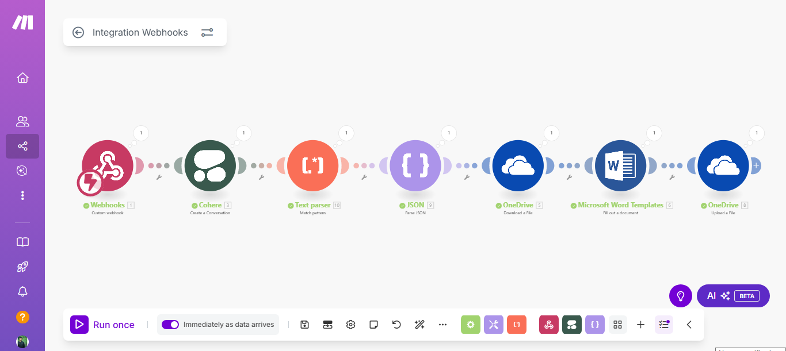

# AI-Powered Resume Tailoring Agent

### A no-code automation that intelligently customizes a master resume for any job description, generating a ready-to-use Word document in seconds.

---

### Visual Workflow

---

### The Problem
Manually tailoring a resume for every single job application is a time-consuming and repetitive process. This can be a major bottleneck in a modern job search, making it difficult to apply to a high volume of roles with the necessary level of personalization required to pass through Applicant Tracking Systems (ATS).

### The Solution
This AI agent acts as a personal resume assistant. It automates the entire tailoring process:
* **Analyzes:** Intelligently reads and understands the keywords and requirements of any job description.
* **Rewrites:** Optimizes the user's master profile content to align perfectly with the target role.
* **Generates:** Creates a professionally formatted Microsoft Word (`.docx`) document, ready to be sent to a recruiter.

This solution reduces the time to create a tailored resume from 30+ minutes to under 60 seconds, enabling a more efficient and effective job application strategy.

---

### Tech Stack
This project was built entirely on a no-code/low-code platform, demonstrating the power of modern automation tools:

* **Orchestration:** **Make.com** (formerly Integromat) was used to design and run the entire visual workflow.
* **AI / "The Brain":** **Cohere's** Large Language Model performs the core task of analyzing and rewriting the resume content.
* **Document Handling:** **Microsoft Word Templates** and **OneDrive** were used to create the final, formatted `.docx` file.
* **Trigger Mechanism:** A **Webhook** serves as the API endpoint to receive the job description and master profile data.

---

### Key Lessons Learned
This project was a deep dive into practical AI implementation and automation:

1.  **The Power of Prompt Engineering:** The success of the agent was directly tied to the quality of the instructions given to the AI. I learned to move from simple conversational prompts to a robust, "production-grade" prompt that commanded the AI to generate a strictly formatted JSON object, which was the key to getting reliable and parsable data.
2.  **Systematic Troubleshooting:** I encountered and solved numerous real-world integration challenges, from API quota limits (`429` errors) and locked file errors (`423` errors) to data mapping failures. This taught me the importance of inspecting the history and logs of each module to perform root cause analysis.
3.  **The Viability of No-Code Solutions:** This project proved that you don't need to be a traditional software developer to build powerful, AI-driven applications. Visual platforms like Make.com can be used to create sophisticated and reliable tools that solve complex, real-world problems.
